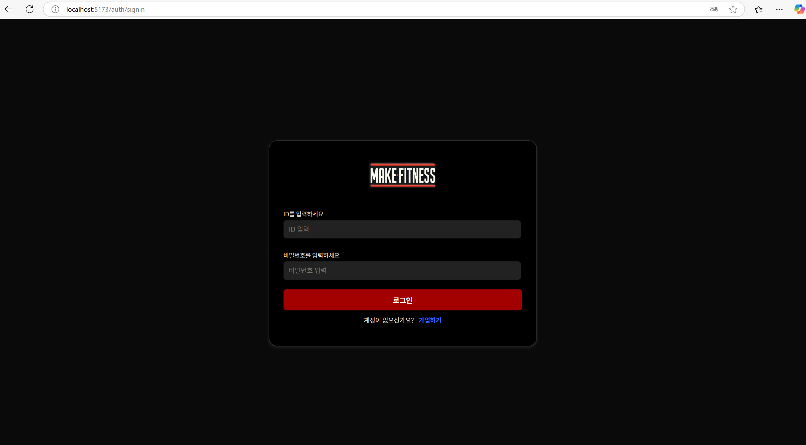
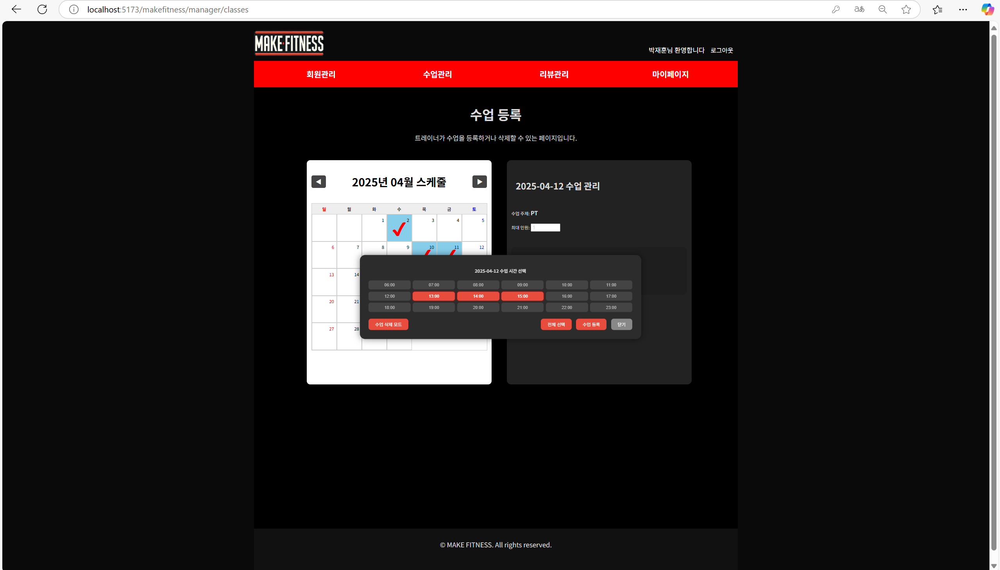
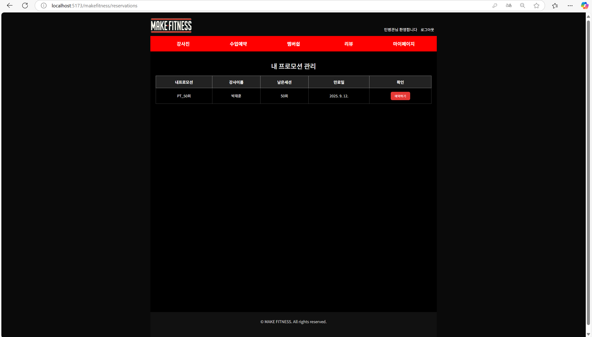
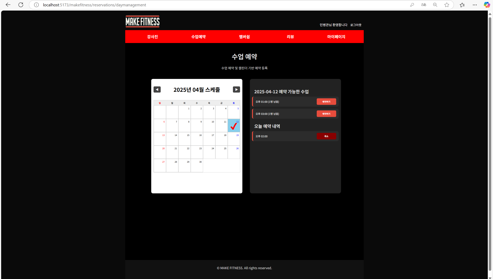
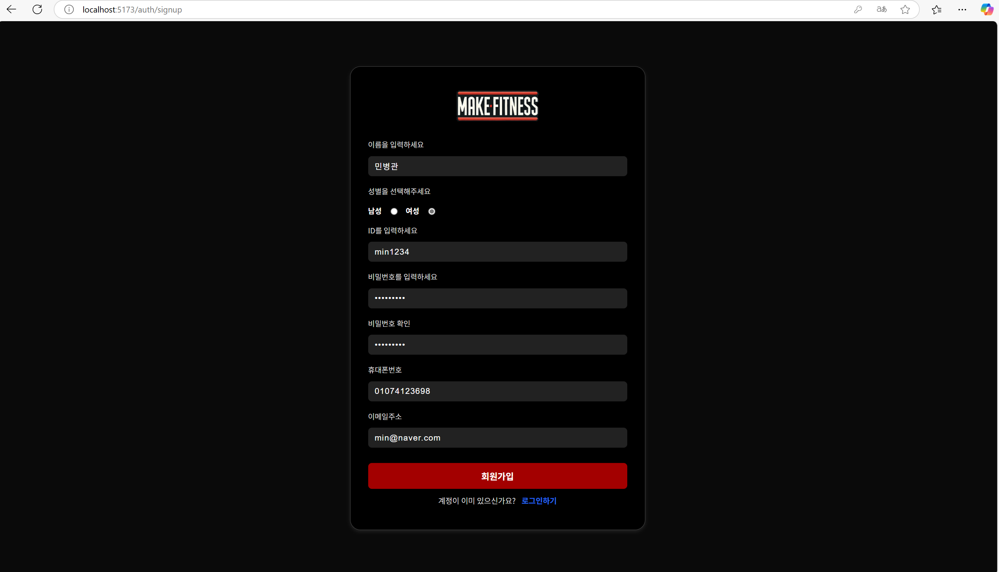
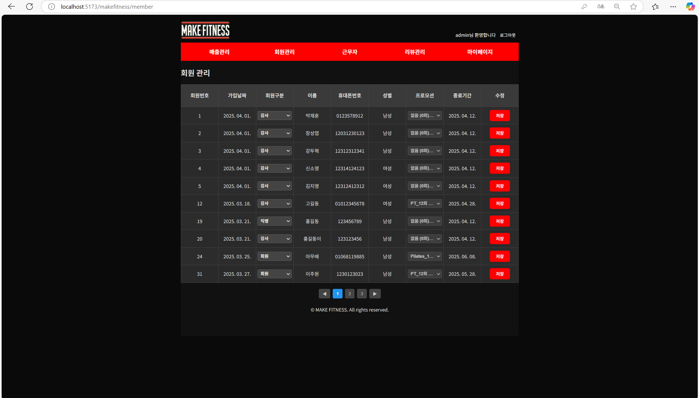
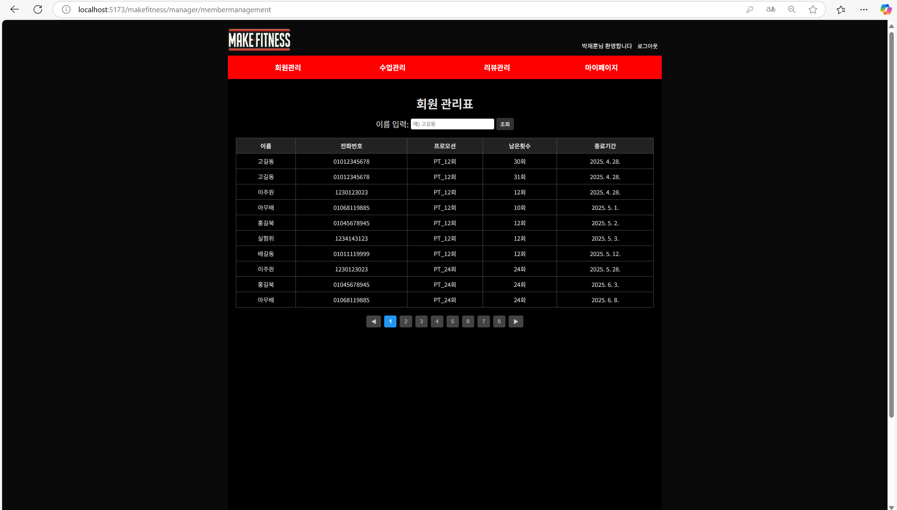
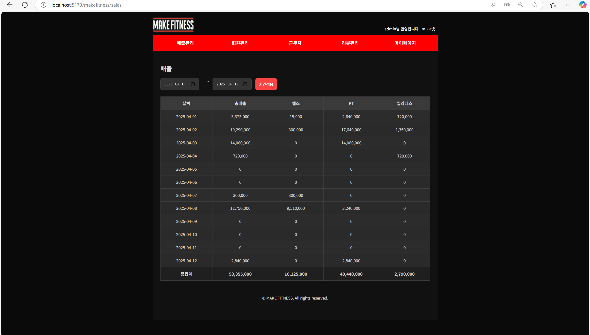
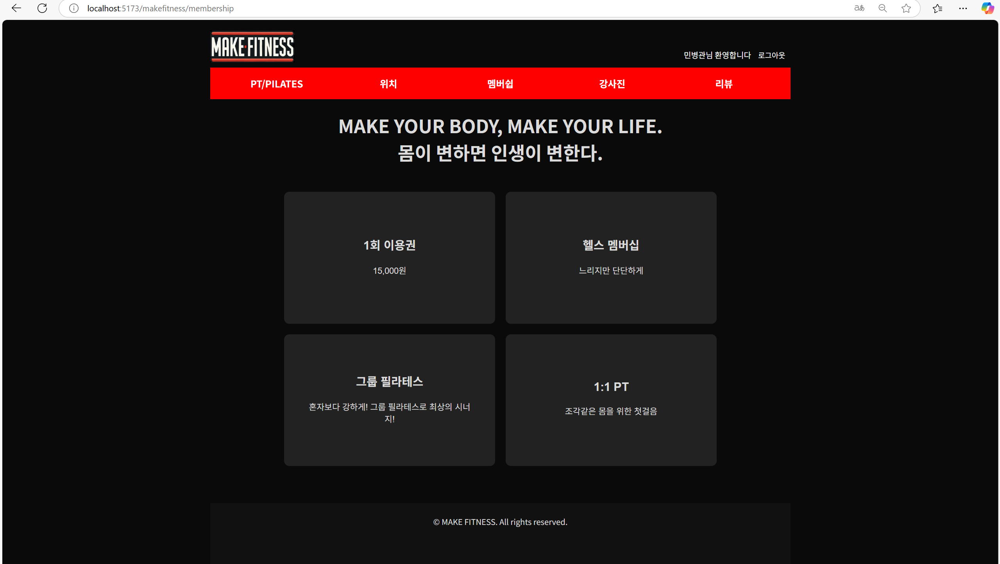
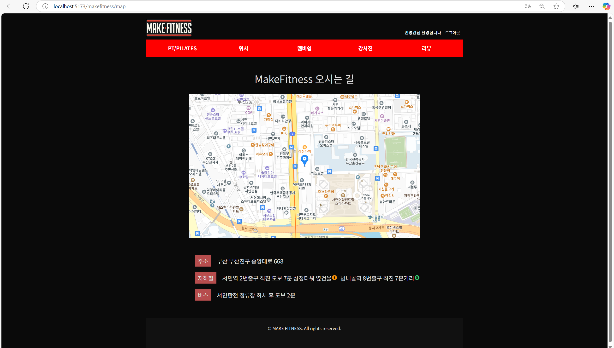

# 🏋️‍♂️ Make Fitness | 헬스 수업 예약 플랫폼

> 트레이너와 회원 간의 **수업 등록**, **예약**, **출결**, **결제** 과정을  
> 효율적으로 연결하는 **웹 기반 통합 헬스 관리 시스템**

---

## 💡 프로젝트 소개

**Make Fitness**는 헬스장을 위한 맞춤형 수업 예약 시스템입니다.  
트레이너는 수업을 등록하고 회원 예약 현황을 실시간으로 확인할 수 있으며,  
회원은 자신의 이용권(프로모션) 범위 내에서 편리하게 수업을 예약하고 출석 내역을 확인할 수 있습니다.

---

## 🎯 주요 기능

### 👥 회원 기능
- JWT 기반 로그인 및 회원 인증
- 보유한 프로모션(이용권) 목록 확인
- 캘린더 기반 수업 예약 및 내역 조회
- 출석 처리된 수업 히스토리 확인

### 🏋️‍♂️ 트레이너 기능
- 수업 등록 (시간대별, 다중 선택 지원)
- 등록된 수업 시간 확인 및 삭제
- 회원별 수업 예약 현황 조회
- 수업 당일 자동 출석 관리

### 💳 결제 시스템
- PortOne 연동으로 결제 처리 (KakaoPay, 카드)
- 프로모션 구매 → 수업 예약 권한 자동 연동
- 수업 예약 시 남은 횟수 자동 차감

---

## ⚙️ 기술 스택

| 구분 | 기술 |
|------|------|
| **Frontend** | React, React Router, Emotion, Axios |
| **Backend** | Spring Boot 3.4.3, Spring Security, MyBatis |
| **Database** | MySQL |
| **CI/CD** | GitHub Actions, NGINX, EC2 |
| **Auth** | JWT 기반 인증 |
| **Payment** | PortOne Browser SDK |
| **문서화** | Swagger (API 문서 자동화) |

---

## 🧱 시스템 아키텍처

```plaintext
[React] ← API 호출 → [Spring Boot + JWT] ←→ [MySQL]
        ↑                            ↓
    [PortOne 결제 SDK]         [GitHub Actions + 배포 서버]

📂 프로젝트 구조
📦 make-fitness/
 ┣ 📁 back/
 ┃ ┣ 📁 controller/
 ┃ ┣ 📁 service/
 ┃ ┣ 📁 repository/
 ┃ ┣ 📁 mapper/
 ┃ ┣ 📁 dto/
 ┃ ┗ 📁 entity/
 ┗ 📁 front/
   ┣ 📁 pages/
   ┣ 📁 components/
   ┣ 📁 apis/
   ┣ 📁 router/
   ┗ 📁 context/

🚀 실행 방법
# 백엔드 실행
cd back
./gradlew bootRun

# 프론트 실행
cd front
npm install
npm run dev

🧪 테스트 계정
Admin
ID: admin1234
PW: admin1234!

Manager
ID: park1234
pw: dong1234!

Customer
ID: wogus2974
pw: wogus2987!

## 🖼️ 주요 화면 예시

### 🔐 로그인


### 📝 수업 등록


### 📅 수업 예약


### 🔍 예약 조회


### 👤 회원가입 / 회원 관리




### 💳 매출 관리


### 📌 멤버십 가입


### 🗺️ 지도

👨‍💻 담당 역할
이름	 역할
이재현	 풀스택 개발 전반
DB 설계 → 피그마 설계 → API 구현 → 프론트 UI 개발 → 배포 자동화

🧠 구현 포인트
예약 제약 조건 설계: 사용자가 구매한 이용권(프로모션)의 트레이너에게만 예약 가능

자동 출석 처리: 당일 수업 자동 출석 체크 및 출결 히스토리 반영

예약 취소/삭제 처리: 수업 삭제 시 예약 자동 취소 및 횟수 복구 처리

실시간 캘린더 반영: 예약/삭제 시 즉시 반영되는 프론트 캘린더 로직

Swagger 문서화 및 GitHub Actions로 CI/CD 자동화

🔗 관련 링크

💻 배포 주소: (https://makefitness.store/)

🧾 노션 주소: (https://lake-guanaco-5fe.notion.site/1af2ef25054380d5bdf8f184138b735e)


